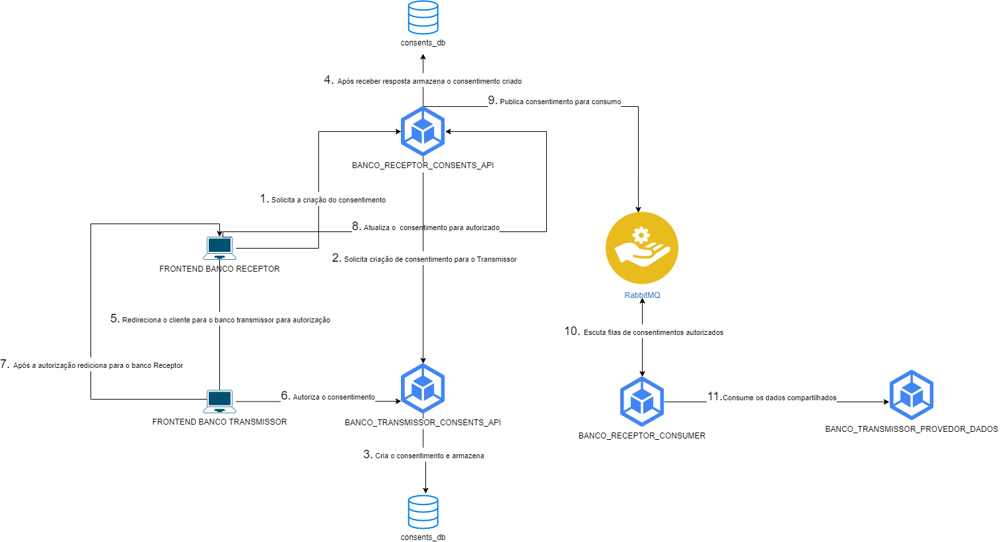

## Trabalho de MICROSERVICE DEVELOPMENT TRABALHO 2

Projeto evolucao do Trabalho 2 do Microservice.

### k8s

Yamls de configuracao estao na pasta /k8s.


### Desenho da solução



### Tecnologias utilizadas

- k8s
- NodeJs
- Typescript
- Nestjs - Framework para backend Nodejs
- Angular
- Nx - Monorepo
- MySQL
- RabbitMQ
- Docker

### Rodando com k8s
- Para executar com k8s:

```
$ kubectl apply -f .\k8s\
```

- Para iniciar o fluxo acesse `http://localhost:4200`


### Desenvolvedores

| RM  | Aluno | Turma |
| ------------- |:-------------:| --------- | 
| 344792      | Benisson dos Santos Lopes     | 1SCJRBB-2022 |
| 344799      | Leonardo Guerra Torres Filho     | 1SCJRBB-2022 |
| 344801      | Lucas Eugenio Ribeiro     | 1SCJRBB-2022 |
| 344794      | César de Lira Santos     | 1SCJRBB-2022 |
| 344791      | Anderson Evangelista     | 1SCJRBB-2022 |